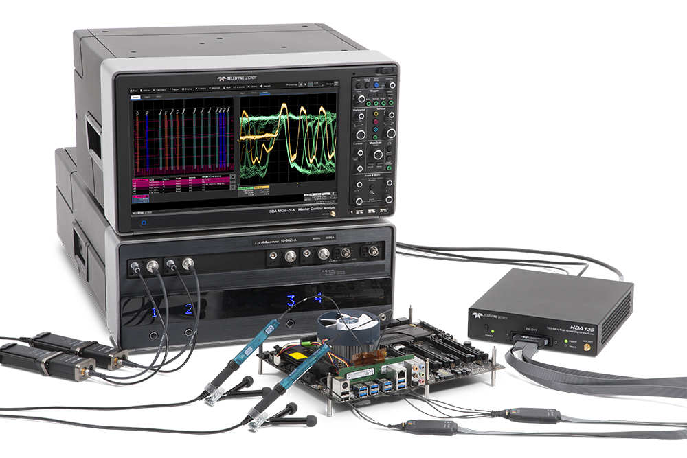
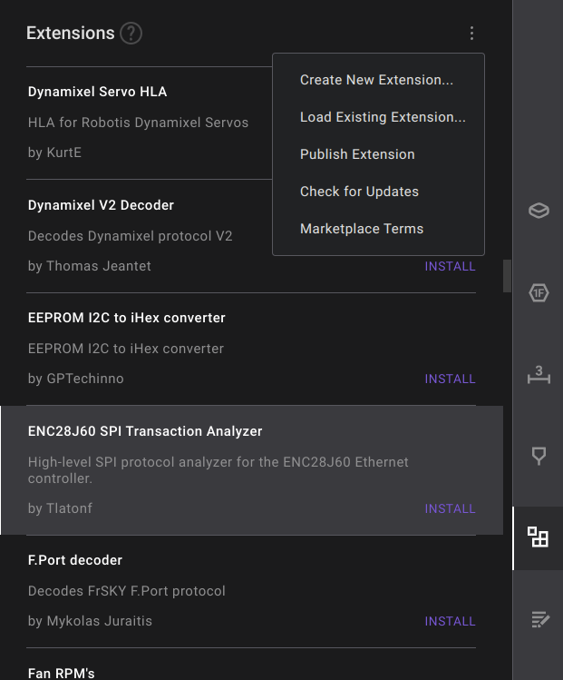
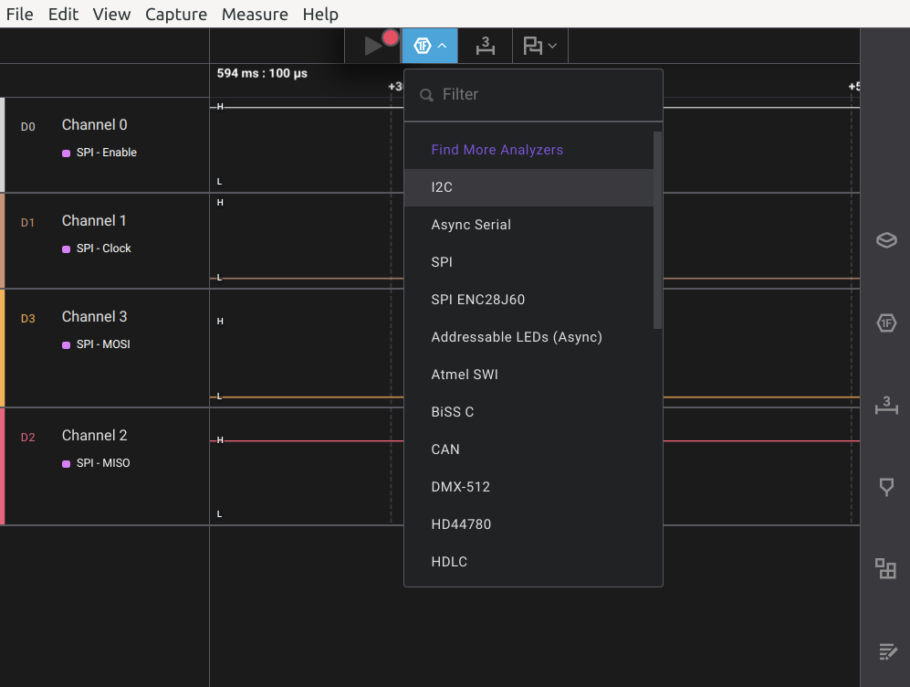
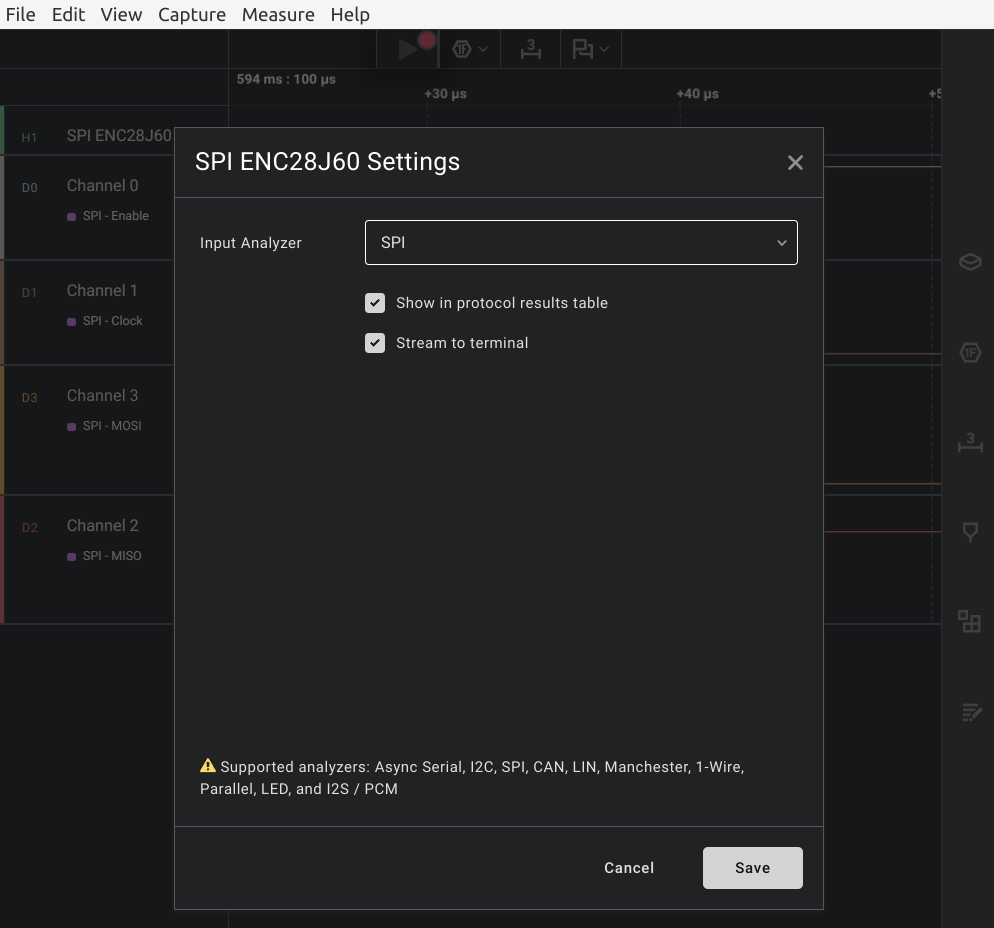
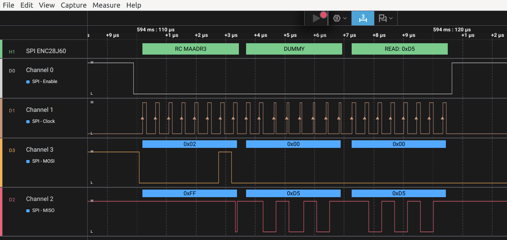
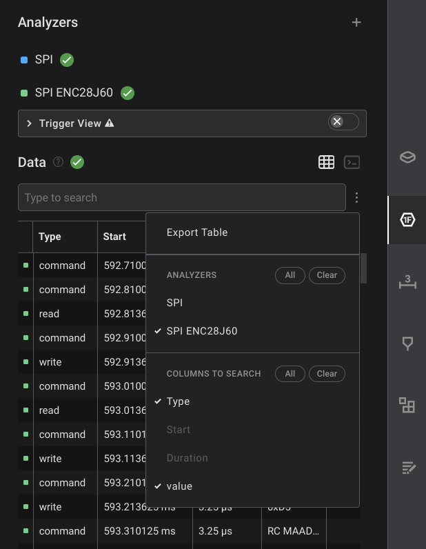
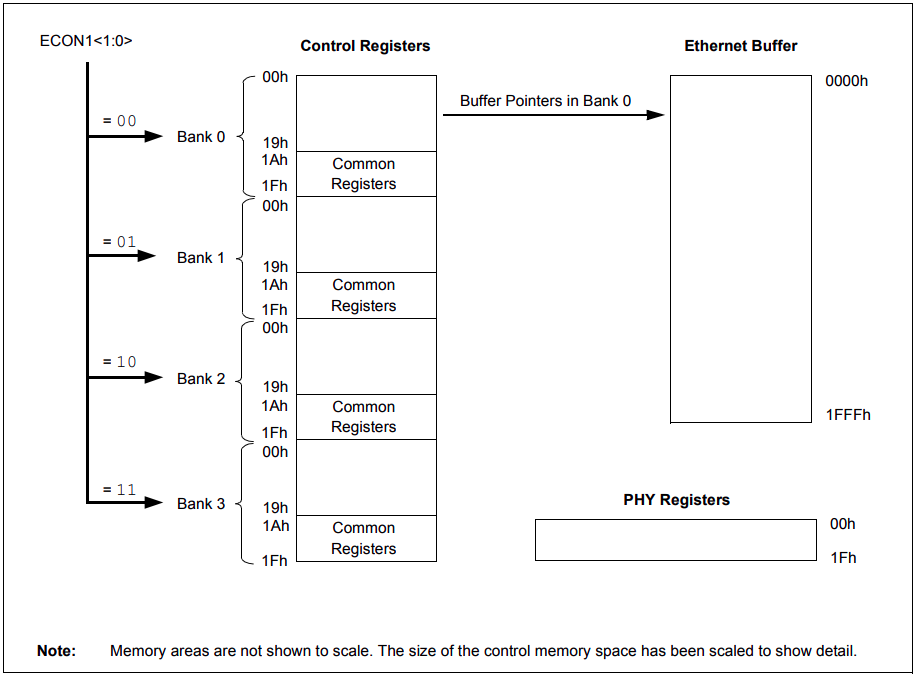

# ENC28J60 SPI Transaction Analyzer

# Overview

The **ENC28J60** is a stand-alone Ethernet controller IC from *Microchip Technology*, designed for embedded applications. It features an integrated **10BASE-T Ethernet PHY**, a full MAC layer, and internal buffer memory. One of its key advantages is the **high-speed SPI interface**, supporting clock speeds up to **20 MHz**, allowing fast and efficient data transfer between the IC and a host microcontroller. This makes the ENC28J60 ideal for low-cost, network-connected systems such as IoT devices and embedded web servers.

The **ENC28J60 SPI Transaction Analyzer** is a high-level protocol extension for [Saleae Logic 2](https://www.saleae.com/), built to **decode and interpret SPI communication** between a microcontroller and the ENC28J60 Ethernet controller. By parsing `commands`, `register accesses`, and `data transfers`, the extension offers a clearer view of the communication process, making it easier to debug and verify Ethernet behavior at the protocol level.

---

# How to use

## Install

- Search for `ENC28J60 SPI Transaction Analyzer` in the **Extensions** tab *(you’ll find it in the right-hand sidebar)*.
- If the extension doesn't show up in the search results, it might be because your extension catalog is out of date. In that case, simply click `Check for Updates` under **More options** *(the icon with three dots)*.
- Click the `Install` button to install the extension.
- And that’s it - simple as that!

## Configue

- First, add the built-in `SPI` analyzer to your capture, as this extension builds on top of it.
- Then, add `SPI ENC28J60` as a new **High-Level Analyzer**.

- When the **SPI ENC28J60 Settings** window appears, set **Input Analyzer** to the `SPI` analyzer you just added.

- If everything is set up correctly, you should see decoded results like the example below:

* This is a tip for you: *To make it easier to view the decoded results, it’s recommended to disable the `SPI` analyzer’s output in the Data section.*

---

# [Warning] Incorrect Capture Timing

* The ENC28J60 uses four register banks to organize its control registers. All banks share the **same address space**, and the **active bank** is determined by the value set in the **ECON1 register** *(see [Section 3.0 Memory Organization](https://ww1.microchip.com/downloads/en/devicedoc/39662c.pdf) for more details)*.

* The **label of the register being accessed** is determined by looking up the `argument` together with the `current_bank`.
* This extension automatically sets the `current_bank` to **BANK0** at two points: (1) when the capture starts, and (2) whenever a soft-reset command is detected.
* **THEREFORE, IF YOU START A CAPTURE AT THE WRONG MOMENT, ALL DECODED DATA FROM THAT POINT ONWARD MAY BE INCORRECT. BE ESPECIALLY CAREFUL WITH THIS CASE!**
